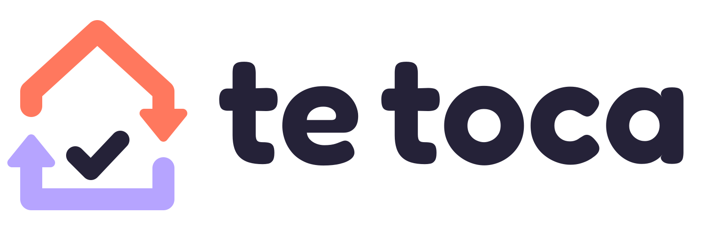
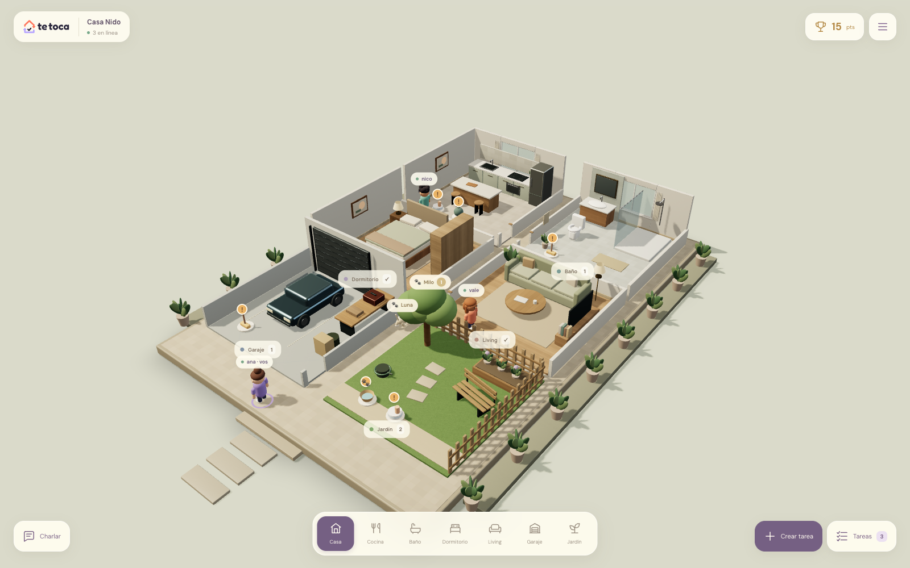
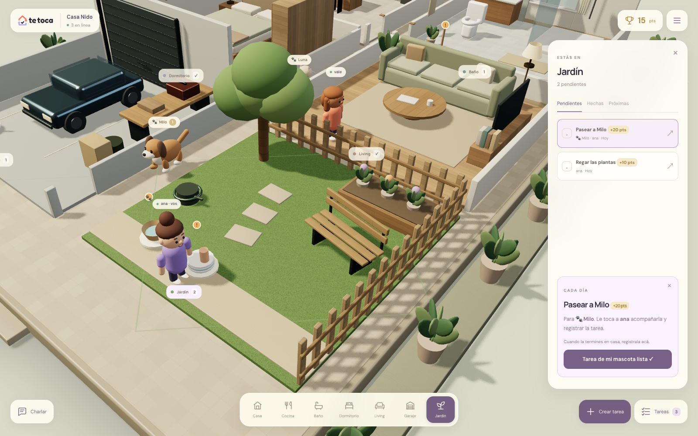
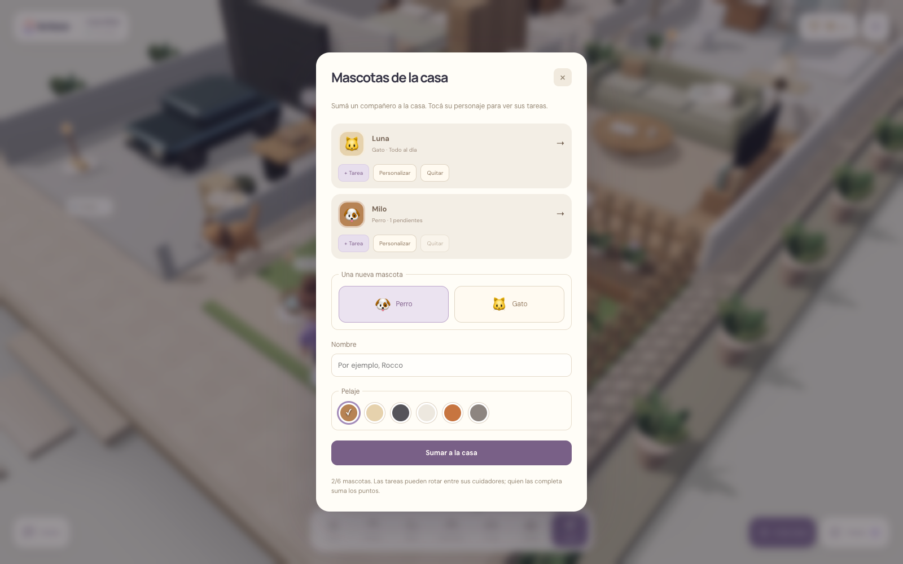
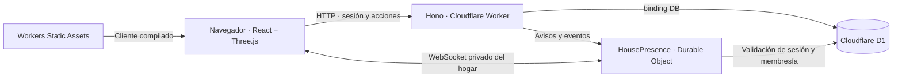

<p align="center">
  
</p>

<h1 align="center">Tu casa, las tareas y quién sigue.</h1>

<p align="center">
  Un juego de navegador para organizar la convivencia: recorré tu casa en 3D,
  encontrá los pendientes de cada habitación y repartí los turnos con quienes viven con vos.
</p>

<p align="center">
  <a href="#cómo-se-juega">Cómo se juega</a> ·
  <a href="#levantar-en-local">Desarrollo local</a> ·
  <a href="#arquitectura">Arquitectura</a> ·
  <a href="#estado-y-próximos-pasos">Estado del proyecto</a>
</p>



*Captura real de la aplicación local con una casa de demostración y datos ficticios.*

> **En desarrollo.** Ya funcionan el acceso, los hogares, las tareas con rotación, el mundo 3D, la presencia en tiempo real y las mascotas. Los intercambios de turnos y la edición de rutinas todavía están pendientes. El repositorio tiene configuración local de Cloudflare; la infraestructura remota sigue sin provisionar.

## La idea

En una casa compartida, alguien suele terminar recordando qué falta hacer, preguntando quién lo hace y renegociando lo mismo cada semana. **Te Toca busca que las responsabilidades estén a la vista y que los turnos sean claros.**

Está pensada para parejas y pequeños grupos de compañeros de vivienda. Cada hogar puede tener hasta **seis integrantes**, **doce ambientes** y **seis mascotas**. También se puede comenzar con una sola persona.

La casa funciona como la interfaz del juego: entrás a la cocina y encontrás los platos pendientes; visitás el jardín y ves a quién le toca regar. Los personajes, las reacciones y los puntos acompañan la convivencia. Las tareas se hacen en la vida real y después se registran en la aplicación.

**Explorar → encontrar una tarea → hacerla → registrarla → ver el progreso compartido.**

## Cómo se juega

1. **Creá tu cuenta.** Solo usuario y contraseña, sin correo ni validación por email.
2. **Armá tu casa o unite por código.** Quien la crea elige nombre y zona horaria y puede invitar al resto.
3. **Personalizá tu personaje.** Elegí piel, pelo, ropa y anteojos. Los demás ven tu avatar cuando estás conectado.
4. **Cargá una tarea en su ambiente.** Indicá frecuencia diaria o semanal, fecha inicial, puntos y responsables. Una persona mantiene la asignación; varias forman una rotación.
5. **Recorré la casa.** Tocá un ambiente para acercarte y un objeto para abrir su tarea. El panel permite consultar pendientes, hechas y próximas.
6. **Confirmá lo que hiciste.** El responsable del turno registra la finalización, suma puntos y comparte la celebración. Puede deshacer durante diez segundos.

La interfaz mantiene el mundo 3D como pantalla principal: arriba están la casa, la conexión, los puntos y el menú; abajo, los ambientes y las acciones de tareas. Los paneles se abren cuando los necesitás.

## Qué podés hacer hoy

| Función | Qué incluye |
| --- | --- |
| **Casa compartida** | Un hogar por cuenta, invitaciones por código y hasta seis integrantes. |
| **Ambientes propios** | Cocina, baño, dormitorio, living, garaje y jardín. Se pueden repetir tipos y ponerles nombre. |
| **Tareas y turnos** | Creación por cualquier integrante, recurrencia diaria/semanal, participantes ordenados y rotación automática. |
| **Progreso** | Puntos por persona y por casa, historial y finalización con opción de deshacer. |
| **Presencia** | Avatares conectados y la habitación que están visitando dentro del juego. |
| **Comunicación** | Chat sobre el personaje, emojis y recordatorios de tareas con «Retar con onda». |
| **Mascotas** | Perros y gatos con nombre y pelaje personalizables, paseos animados y tareas asociadas. |
| **Vista simple** | Navegación por ambientes y listas sin la escena 3D; respeto de la preferencia de movimiento reducido. |

### Una casa que podés ampliar

Desde **Menú → Mi casa**, quien administra agrega, renombra o quita ambientes vacíos. La distribución se acomoda automáticamente en dos columnas con un pasillo central.

Cada casa empieza con cocina, baño, dormitorio y living. Podés sumar otro baño, un dormitorio de invitados, un garaje con auto y herramientas o un jardín con césped, árbol, cantero y banco. Cada ambiente conserva sus propias tareas.

La escena combina geometrías propias, materiales procedurales de madera, tela, piedra y césped, vidrio, iluminación cálida y sombras. Se presenta como una maqueta abierta para mantener visibles los personajes y las tareas. No necesita descargar modelos, texturas ni entornos HDR externos.

### Mascotas con su lugar en la casa

Desde **Menú → Mascotas**, cualquier integrante puede agregar perros o gatos y personalizar su nombre y pelaje. Pasean por las habitaciones, hacen pausas y muestran un contador de pendientes. Tocarlos abre su lista de tareas.

Al crear una tarea podés asociarla a una mascota: por ejemplo, **dar de comer a Luna**, **pasear a Milo** o **practicar un truco**. La tarea aparece en su ficha y en el ambiente elegido. Una persona o una rotación de cuidadores se encarga de registrarla; los puntos se asignan a quien la completa.



<details>
<summary>Ver el módulo de mascotas</summary>



</details>

### Convivir en tiempo real

- **Personajes:** cada integrante conectado aparece en la casa; al cambiar de ambiente, los demás ven su desplazamiento.
- **Chat:** hasta 160 caracteres por mensaje, visibles durante ocho segundos sobre el autor. El panel conserva los últimos treinta mensajes de la sesión; no hay historial persistente ni entrega fuera de línea.
- **Reacciones:** 😡, 🖕, 👍 y ❤️ aparecen sobre el personaje que las envía.
- **Recordatorios:** «Retar con onda» avisa al responsable de una tarea pendiente de hoy o anterior. Si está desconectado, el recordatorio queda disponible al volver. Hay cinco minutos de espera por tarea para toda la casa y no se descuentan puntos.
- **Cambios compartidos:** tareas, puntajes, apariencia, ambientes y mascotas se actualizan para los integrantes conectados.

## Levantar en local

### Requisitos

- **Node.js 22.12 o posterior dentro de la rama 22**, compatible con las dependencias actuales.
- **npm** y Git.
- Un navegador con WebGL para la escena 3D.

El entorno local emula Workers, D1 y Durable Objects. No necesitás configurar correo, una cuenta de Cloudflare ni claves de APIs para usarlo localmente.

```bash
git clone git@github.com:CharlyMoreno/te-toca.git
cd te-toca
npm ci
npm run db:migrate:local
npm run dev
```

Abrí **[http://127.0.0.1:5173](http://127.0.0.1:5173)**. Si el puerto está ocupado, usá la URL que informe Vite en la terminal.

Los comandos se ejecutan desde la raíz del repositorio. Aunque el código está dividido en `frontend/` y `backend/`, **un solo `npm run dev` levanta ambos** mediante el plugin de Cloudflare para Vite.

### Primera recorrida

1. Registrate y creá una casa.
2. Desde **Menú → Mi personaje**, configurá tu avatar.
3. Usá **Crear tarea** para agregar un pendiente de hoy y asignártelo.
4. Tocá la habitación y el objeto de la tarea para abrir su detalle.
5. Desde el menú, agregá ambientes o mascotas. **Vista simple** permite usar las listas sin 3D.

Para ver la presencia compartida, abrí otra sesión en un perfil distinto o una ventana de incógnito, creá otra cuenta y unila con el código de **Menú → Integrantes**. Dos pestañas que comparten la misma sesión representan a la misma persona.

### Comandos útiles

| Comando | Uso |
| --- | --- |
| `npm run dev` | Frontend y Worker en desarrollo. |
| `npm run db:migrate:local` | Aplica todas las migraciones pendientes a la D1 local. |
| `npm run build` | Comprueba tipos y genera los artefactos del cliente y el Worker. |
| `npm run preview` | Sirve la compilación para una revisión local. Requiere un build previo. |
| `npm run db:migrate:remote` | Aplica migraciones a una D1 remota ya configurada. |

Los datos locales persisten en `.wrangler/state`, que está excluido de Git. Después de actualizar el repositorio, volvé a ejecutar las migraciones antes de levantar la app. La última incorporada es `0007_garden_garage_pets.sql`.

## Reglas que conviene conocer

- **Permisos:** todos pueden crear tareas y asignarlas a integrantes de la casa. La administración genera invitaciones, modifica ambientes, pausa rutinas y quita mascotas sin tareas asociadas.
- **Invitaciones:** vencen a los siete días. Generar un código nuevo revoca el anterior; el hogar admite hasta seis personas.
- **Rotación:** cada rutina tiene su propia cola de participantes. Los turnos avanzan por fecha, independientemente de cuándo se complete el anterior. Los atrasos conservan su responsable.
- **Calendario:** las fechas se interpretan en la zona horaria del hogar. Al consultar tareas se generan los turnos pendientes y los próximos siete días.
- **Finalización:** solo el responsable puede completar una ocurrencia de hoy o anterior. Los turnos futuros todavía no se pueden marcar como hechos.
- **Puntajes:** cada tarea vale entre 5 y 100 puntos. El tablero suma las finalizaciones de todo el historial; deshacer revierte sus puntos.
- **Pausas:** detienen la generación de turnos nuevos y conservan los ya creados. La interfaz todavía no permite editar ni reactivar una rutina.
- **Ambientes y mascotas:** solo se pueden quitar si no tienen tareas asociadas, incluso pausadas. La casa debe conservar al menos un ambiente.
- **Paseos de mascotas:** se calculan en cada cliente con un recorrido determinista y su reloj; no representan ubicación real ni transmiten posiciones por el socket. Con movimiento reducido permanecen quietas.

## Arquitectura



| Capa | Tecnologías y responsabilidad |
| --- | --- |
| **Interfaz** | React, TypeScript y Vite: acceso, menús, formularios y listas. |
| **Mundo 3D** | Three.js, React Three Fiber y Drei: casa, personajes, mascotas e interacciones. |
| **API** | Hono sobre Cloudflare Workers: sesiones, permisos y reglas de negocio. |
| **Persistencia** | Cloudflare D1: usuarios, hogares, ambientes, mascotas, tareas, ocurrencias e historial. |
| **Tiempo real** | WebSockets y un Durable Object por casa: presencia, mensajes, reacciones y avisos de cambios. |

Las acciones persistentes se guardan por HTTP en D1. Después, el socket avisa a la casa y los clientes consultan los datos actualizados. La escena representa ese estado; hacer clic en un objeto solo abre la tarea. La lógica de asignación y finalización vive en el backend.

### Organización del repositorio

```text
frontend/
  public/brand/          Logos y recursos de marca
  src/
    App.tsx             Acceso y entrada al hogar
    game/               Escena 3D, personajes, mascotas y paneles
backend/
  index.ts              Worker y rutas de la API
  auth.ts               Registro, acceso y sesiones
  homes.ts              Hogares e invitaciones
  rooms.ts              Ambientes
  pets.ts               Mascotas
  tasks.ts              Rutinas, ocurrencias, puntos e historial
  presence.ts           WebSockets y Durable Object
  migrations/           Migraciones SQL de D1
shared/                 Catálogos y tipos compartidos
docs/                  Contexto funcional, datos e infraestructura
wrangler.jsonc          Configuración del Worker, D1 y Durable Objects
vite.config.ts          Desarrollo integrado del cliente y el Worker
```

### Acceso y datos

El registro usa usuario y contraseña, sin email. Las contraseñas se guardan como **hashes bcrypt con salt aleatorio**, nunca en texto plano. Las sesiones usan cookies `HttpOnly`, `SameSite=Lax` y `Secure` sobre HTTPS; duran treinta días. Hay límites de intentos de acceso.

El Worker valida identidad, pertenencia al hogar y permisos en cada operación. El navegador nunca accede directamente a D1. Las cuentas antiguas con clave personal tienen un flujo para elegir usuario y contraseña conservando sus datos.

No hay recuperación de contraseña implementada. Los archivos de entorno, las sesiones y el estado local están fuera del repositorio; las capturas usan únicamente datos ficticios.

### Publicación en Cloudflare

El destino previsto es un Worker que sirva la API y el frontend con **Workers Static Assets**, junto con D1 y Durable Objects. `wrangler.jsonc` ya declara los bindings `DB` y `HOUSE_PRESENCE` y la migración del Durable Object.

**La configuración remota está pendiente:** el `database_id` sigue siendo un valor de ejemplo. Antes de publicar se debe crear la D1 real, configurar los recursos y el entorno, aplicar sus migraciones y desplegar el Worker con los assets compilados. El plan de ejecución debe contemplar el consumo de CPU de bcrypt con costo 12.

Los detalles y decisiones pendientes están en [Infraestructura](docs/INFRAESTRUCTURA.md).

## Estado y próximos pasos

### Implementado

- [x] Registro y login con usuario y contraseña.
- [x] Creación de hogares e invitación por código.
- [x] Tareas recurrentes, rotación, finalización, deshacer, historial y puntos.
- [x] Casa 3D ampliable con seis tipos de ambiente.
- [x] Personalización de avatares y presencia compartida.
- [x] Chat temporal, emojis y recordatorios.
- [x] Mascotas personalizables con paseo y tareas asociadas.
- [x] Vista simple y movimiento reducido.

### Pendiente

- [ ] Proponer y aceptar intercambios de dos turnos entre integrantes.
- [ ] Editar y reactivar rutinas conservando la coherencia de los turnos.
- [ ] Recuperación de cuentas.
- [ ] Provisionar y publicar los entornos remotos.
- [ ] Validar la convivencia real con hogares y revisar rendimiento y usabilidad en distintos dispositivos.

Quedan fuera del alcance actual los pagos, las aplicaciones nativas, el uso sin conexión, varios hogares por cuenta, las notificaciones externas y un editor libre de paredes o pisos. La rotación reparte turnos; no calcula un reparto equivalente de esfuerzo total entre personas.

## Documentación

- [Definición funcional del MVP](docs/MVP_FUNCIONAL.md): contexto, flujos y alcance previsto, incluidos los intercambios pendientes.
- [Modelo de datos](docs/DB_MODEL.md): entidades, migraciones y relaciones implementadas.
- [Infraestructura](docs/INFRAESTRUCTURA.md): arquitectura, publicación y operación previstas.
- [Capturas](docs/screenshots/README.md): contexto de las imágenes de esta página.

Este README resume el estado implementado. Los documentos de diseño también incluyen funcionalidades futuras; el listado de pendientes anterior indica cuáles todavía no están disponibles.
