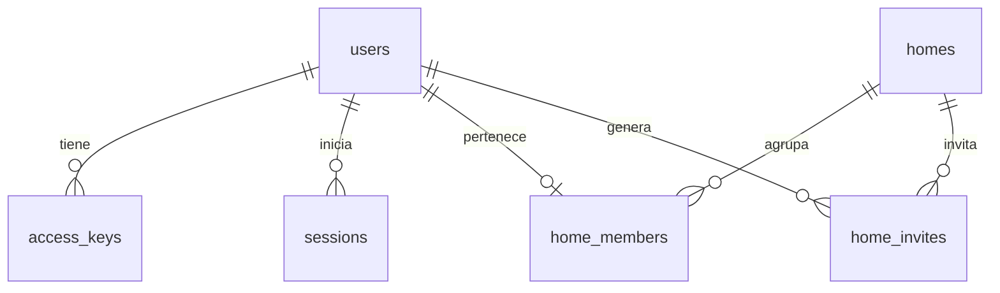

# Modelo de datos — Te Toca

La base elegida es **Cloudflare D1**. Las fuentes del esquema actual son [`0001_auth.sql`](../backend/migrations/0001_auth.sql) y [`0002_tasks.sql`](../backend/migrations/0002_tasks.sql).

## Implementado: acceso y casa

| Tabla | Para qué sirve | Regla importante |
| --- | --- | --- |
| `users` | Identidad interna y nombre visible | No guarda correo. |
| `access_keys` | Clave personal para volver a entrar | Guarda solo SHA-256 de un secreto aleatorio de 100 bits. Puede revocarse en una etapa posterior. |
| `sessions` | Sesiones activas | Guarda solo el hash de la cookie; vence a los 30 días. |
| `auth_rate_limits` | Controlar intentos de crear perfil, entrar y unirse | Ventanas de 15 minutos; la clave incluye un hash del identificador. |
| `homes` | Nombre, zona horaria y creador de la casa | Identificador único. |
| `home_members` | Relación usuario–casa y rol | `user_id` es único: un usuario pertenece a una casa como máximo. |
| `home_invites` | Códigos para unirse a una casa | Guarda solo el hash; expira a los siete días y puede revocarse al generar otro. |

Al crear un perfil, la API guarda usuario, hash de la clave y sesión. La clave original aparece una sola vez en el navegador. Al crear una casa, la API inserta casa y membresía de administrador en una operación atómica. La unión por invitación comprueba en D1 que el código siga vigente, que haya menos de seis integrantes y que el usuario todavía no pertenezca a otra casa.

La sesión se envía en una cookie `HttpOnly`, `SameSite=Lax` y `Secure` cuando la aplicación usa HTTPS. El navegador no recibe credenciales de D1.

## Implementado: tareas y turnos

| Tabla | Función y restricciones |
| --- | --- |
| `tasks` | Hogar, título, habitación, objeto, frecuencia diaria/semanal, fecha inicial y estado activo. |
| `task_participants` | Usuarios de la casa participantes, con posición única por tarea. |
| `task_occurrences` | Fecha, responsable original y actual, finalización y clave de última operación. Combinación tarea–fecha única. |
| `activity_events` | Historial de finalizaciones y acciones de deshacer, con hogar, actor y ocurrencia. |

Las habitaciones son valores controlados: `kitchen`, `bathroom`, `bedroom`, `living`. La escena traduce sus nombres al español. Las posiciones, muebles, colores y animaciones viven en el frontend.

Al consultar las tareas, la API genera ocurrencias hasta siete días después de la fecha actual del hogar. El responsable se calcula desde la fecha inicial y el orden de participantes. Las inserciones son idempotentes por tarea y fecha; los atrasos conservan su responsable. Una pausa detiene la generación futura, sin borrar turnos ya generados.

Completar solo está permitido al responsable, dentro de su casa y para fechas actuales o pasadas. La actualización condicional y el evento se escriben juntos mediante `DB.batch`; una clave de operación evita registrar eventos duplicados. Deshacer requiere el mismo responsable y un plazo de diez segundos. La lista conserva finalizaciones de los últimos treinta días; el historial entrega los últimos cien eventos.

## Pendiente

`task_swaps` todavía no tiene migración ni endpoints. Se incorporará con el flujo de propuestas y aceptación atómica de intercambios. También falta la edición de rutinas y su reactivación. El valor `swapped` del historial está reservado para esa implementación.
