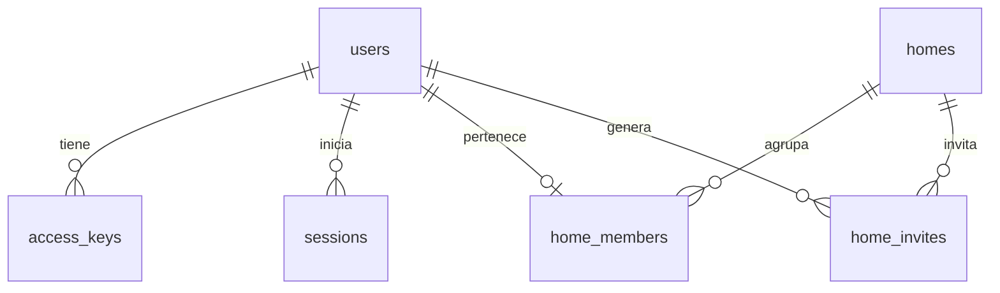

# Modelo de datos — Te Toca

La base elegida es **Cloudflare D1**. Las fuentes del esquema actual son [`0001_auth.sql`](../backend/migrations/0001_auth.sql), [`0002_tasks.sql`](../backend/migrations/0002_tasks.sql) y [`0003_avatars.sql`](../backend/migrations/0003_avatars.sql).

## Implementado: acceso y casa

| Tabla | Para qué sirve | Regla importante |
| --- | --- | --- |
| `users` | Identidad interna y nombre visible | No guarda correo. |
| `access_keys` | Clave anterior, solo para migrar una cuenta existente | Guarda SHA-256; se revoca al configurar usuario y contraseña. |
| `sessions` | Sesiones activas | Guarda solo el hash de la cookie; vence a los 30 días. |
| `auth_rate_limits` | Controlar intentos de crear perfil, entrar y unirse | Ventanas de 15 minutos; la clave incluye un hash del identificador. |
| `homes` | Nombre, zona horaria y creador de la casa | Identificador único. |
| `home_members` | Relación usuario–casa y rol | `user_id` es único: un usuario pertenece a una casa como máximo. |
| `home_invites` | Códigos para unirse a una casa | Guarda solo el hash; expira a los siete días y puede revocarse al generar otro. |

Al crear un perfil, la API guarda usuario, credenciales con contraseña hasheada y sesión en un lote atómico. Al crear una casa, la API inserta casa y membresía de administrador en una operación atómica. La unión por invitación comprueba en D1 que el código siga vigente, que haya menos de seis integrantes y que el usuario todavía no pertenezca a otra casa.

La sesión se envía en una cookie `HttpOnly`, `SameSite=Lax` y `Secure` cuando la aplicación usa HTTPS. El navegador no recibe credenciales de D1.

## Implementado: tareas y turnos

| Tabla | Función y restricciones |
| --- | --- |
| `tasks` | Hogar, título, habitación, objeto, frecuencia diaria/semanal, fecha inicial y estado activo. |
| `task_participants` | Usuarios de la casa participantes, con posición única por tarea. |
| `task_occurrences` | Fecha, responsable original y actual, finalización y clave de última operación. Combinación tarea–fecha única. |
| `activity_events` | Historial de finalizaciones y acciones de deshacer, con hogar, actor y ocurrencia. |

Las tareas apuntan a un ambiente mediante `room_id`. El campo anterior `room` conserva su tipo (`kitchen`, `bathroom`, `bedroom`, `living`) para compatibilidad del esquema. Las posiciones, muebles, colores y animaciones viven en el frontend.

Al consultar las tareas, la API genera ocurrencias hasta siete días después de la fecha actual del hogar. El responsable se calcula desde la fecha inicial y el orden de participantes. Las inserciones son idempotentes por tarea y fecha; los atrasos conservan su responsable. Una pausa detiene la generación futura, sin borrar turnos ya generados.

Completar solo está permitido al responsable, dentro de su casa y para fechas actuales o pasadas. La actualización condicional y el evento se escriben juntos mediante `DB.batch`; una clave de operación evita registrar eventos duplicados. Deshacer requiere el mismo responsable y un plazo de diez segundos. La lista conserva finalizaciones de los últimos treinta días; el historial entrega los últimos cien eventos.

## Implementado: apariencia y presencia

`users.avatar_json` guarda una configuración validada de piel, peinado, color de pelo, remera, pantalón y anteojos. Las opciones permitidas y valores iniciales se comparten en `shared/avatar.ts`. Los perfiles anteriores usan la apariencia predeterminada hasta personalizarla. `PUT /api/profile/avatar` modifica únicamente el perfil de la sesión; `/api/homes/current` devuelve la apariencia de sus integrantes.

La presencia es temporal: no se escribe en D1 con cada movimiento. Un Durable Object `HousePresence` por hogar mantiene conexiones y attachments con usuario autenticado, hash de sesión, habitación, visibilidad y latido. Verifica sesiones y membresías en D1, elimina conexiones vencidas y entrega una sola entrada por persona. El hash de sesión nunca se emite al cliente. Los sockets solo aceptan latidos y cambios de habitación; las operaciones de negocio siguen en la API HTTP.

## Implementado: puntos y recordatorios

La migración [`0004_points_nudges.sql`](../backend/migrations/0004_points_nudges.sql) agrega `points` a `tasks` y `task_occurrences` (entero de 5 a 100, valor inicial 10). La generación copia el valor a cada ocurrencia. El tablero agrupa las ocurrencias completadas por `completed_by`, dentro del hogar. No hay contador mutable que pueda sumar dos veces: completar y deshacer cambian la fuente del total. Las ocurrencias existentes reciben diez puntos, incluso las ya completadas.

`task_nudges` conserva el último recordatorio por ocurrencia, con identificador de evento, actor, destinatario y fecha. Un `INSERT … SELECT … ON CONFLICT … WHERE` comprueba a la vez que la ocurrencia pertenezca al hogar, siga pendiente, no sea futura, corresponda a otra persona y hayan pasado cinco minutos desde el último recordatorio. El aviso se devuelve junto a los pendientes; no modifica los puntos.

Los eventos de juego del servidor se publican al Durable Object por su binding interno. El socket del cliente no permite emitir eventos de puntos ni recordatorios directamente. El cliente vuelve a consultar la API al recibirlos y al reconectar. Las animaciones son efímeras; los datos de tarea, puntaje y recordatorio permanecen en D1.

## Implementado: usuario y contraseña

[`0005_password_login.sql`](../backend/migrations/0005_password_login.sql) crea `user_credentials`: `user_id` único, `username` único con comparación `NOCASE`, `password_hash` y fecha de creación. El username se normaliza a minúsculas. Bcrypt con costo 12 incorpora un salt aleatorio al hash; no se guarda la contraseña original.

El registro inserta usuario, credenciales y sesión atómicamente. Una colisión de username no deja perfiles huérfanos. Login devuelve siempre el mismo error para usuario o contraseña incorrectos y realiza una comparación bcrypt también para usuarios inexistentes. Se conservan los límites por IP y se agrega uno por username.

`/auth/me` informa si una cuenta anterior necesita configurar credenciales. `/auth/legacy-login` acepta una clave anterior vigente únicamente mientras el perfil no tenga contraseña. `/auth/credentials` requiere sesión, inserta credenciales y revoca claves antiguas en un mismo lote; no permite sobrescribir una contraseña existente. Los identificadores, casas, tareas, avatares y puntos permanecen asociados al mismo usuario.

Los sockets también admiten reacciones del catálogo `shared/emotes.ts`. Se revalida la sesión y el destinatario antes de publicar el emoji. No necesitan tablas: son estado efímero del juego.

## Implementado: ambientes por hogar

[`0006_rooms.sql`](../backend/migrations/0006_rooms.sql) crea `rooms`: identificador, hogar, nombre, tipo, posición lógica (`slot`) y fecha. El slot es único por hogar y está limitado a 0–11. La migración crea los cuatro ambientes iniciales de cada hogar y vincula sus tareas mediante `tasks.room_id`; los IDs de tareas y ocurrencias no cambian.

`tasks.room_id` tiene clave foránea a `rooms`. Los triggers de inserción y actualización exigen que la habitación pertenezca al mismo hogar y que el tipo anterior sea consistente. La API devuelve `room` como identificador concreto del ambiente, tanto en tareas como en historial y eventos.

`/api/rooms` permite listar ambientes de la propia casa. Crear, renombrar y quitar requieren administración. La creación selecciona un slot libre mediante una sola sentencia; quitar requiere que no haya tareas referenciándolo y que quede otro ambiente en el hogar. Las nuevas casas insertan sus ambientes iniciales en el mismo lote que hogar y membresía.

La distribución visual se calcula en `shared/rooms.ts`: dos columnas y un corredor central, sin persistir coordenadas de geometría. Los mensajes de movimiento del socket validan que el ID de habitación exista dentro del hogar. Las mutaciones emiten la invalidación habitual para que los clientes actualicen el plano.

## Pendiente

`task_swaps` todavía no tiene migración ni endpoints. Se incorporará con el flujo de propuestas y aceptación atómica de intercambios. También falta la edición de rutinas y su reactivación. El valor `swapped` del historial está reservado para esa implementación.

## Garaje, jardín y mascotas

`0007_garden_garage_pets.sql` agrega `rooms.room_type` con seis tipos visibles y copia el tipo de cada ambiente existente. `rooms.kind` y `tasks.room` conservan los cuatro valores históricos para mantener sus CHECK y claves foráneas sin reconstruir tablas padre: garaje y jardín usan `living` en esos campos de compatibilidad. La API de ambientes expone `room_type` como `kind`; las tareas y la presencia siguen usando el identificador del ambiente.

`pets` guarda ID, hogar, nombre (1–24 caracteres), especie (`dog`/`cat`), color del catálogo y fecha de creación. Un INSERT condicional limita a seis mascotas por casa de forma atómica. Todos los integrantes pueden crear y personalizar mascotas de su propio hogar; eliminarlas requiere administración y ninguna tarea referenciada.

`tasks.pet_id` es una FK opcional, indexada, con triggers que exigen que la mascota pertenezca al hogar de la tarea. La asociación permanece fija durante la rutina y se devuelve en ocurrencias, rutinas e historial. `task_participants`, `assignee` y `completed_by` siguen siendo personas: representan cuidadores, conservan la rotación y reciben los puntos. Las mascotas no son usuarios ni tienen credenciales o presencia autenticada. Los cambios invalidan la vista del hogar mediante el socket existente; la animación del recorrido se calcula en el cliente.
