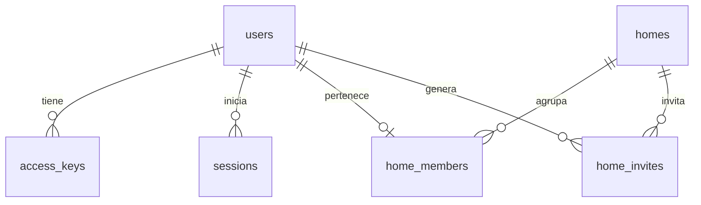

# Modelo de datos — Te Toca

La base elegida es **Cloudflare D1**. Este documento distingue las tablas ya creadas para el acceso de las que se agregarán cuando implementemos las tareas. La fuente exacta del esquema actual es [`backend/migrations/0001_auth.sql`](../backend/migrations/0001_auth.sql).

## Implementado: acceso y casa

| Tabla | Para qué sirve | Regla importante |
| --- | --- | --- |
| `users` | Identidad interna y nombre visible | No guarda correo. |
| `access_keys` | Clave personal para volver a entrar | Guarda solo SHA-256 de un secreto aleatorio de 100 bits. Puede revocarse en una etapa posterior. |
| `sessions` | Sesiones activas | Guarda solo el hash de la cookie; vence a los 30 días. |
| `auth_rate_limits` | Controlar intentos de crear perfil, entrar y unirse | Ventanas de 15 minutos; la clave incluye un hash del identificador. |
| `homes` | Nombre, zona horaria y creador de la casa | Identificador único. |
| `home_members` | Relación usuario–casa y rol | `user_id` es único: un usuario pertenece a una casa como máximo. |
| `home_invites` | Códigos para unirse a una casa | Guarda solo el hash; expira a los siete días y puede revocarse al generar otro. |

Al crear un perfil, la API guarda usuario, hash de la clave y sesión. La clave original aparece una sola vez en el navegador. Al crear una casa, la API inserta casa y membresía de administrador en una operación atómica. La unión por invitación comprueba en D1 que el código siga vigente, que haya menos de seis integrantes y que el usuario todavía no pertenezca a otra casa.

La sesión se envía en una cookie `HttpOnly`, `SameSite=Lax` y `Secure` cuando la aplicación usa HTTPS. El navegador no recibe credenciales de D1.

## Previsto para los siguientes módulos

Estas entidades aún **no tienen migración ni endpoints**:

| Entidad prevista | Relación principal | Función |
| --- | --- | --- |
| `tasks` | Pertenece a `homes` y a una habitación | Nombre, icono, frecuencia, primera fecha y estado. |
| `task_participants` | Relaciona `tasks` con `home_members` | Orden de la rotación de responsables. |
| `task_occurrences` | Pertenece a `tasks` | Fecha concreta, responsable original y actual, estado y finalización. La combinación tarea–fecha será única. |
| `task_swaps` | Referencia dos `task_occurrences` | Propuesta, respuesta y estado del intercambio. |
| `activity_events` | Referencia hogar y actor | Registro de tareas hechas, deshechas e intercambios. |

La habitación puede ser un valor controlado de la tarea (`cocina`, `bano`, `dormitorio`, `comun`) mientras la casa tenga cuatro ambientes fijos. Cuando se habilite personalizar habitaciones, se podrá crear una tabla propia y migrar esos valores.

Los modelos 3D, las posiciones de objetos y las animaciones serán recursos del cliente. D1 guardará los datos del juego que afectan a todos: qué tareas existen, quién debe hacerlas y cuáles se completaron.
