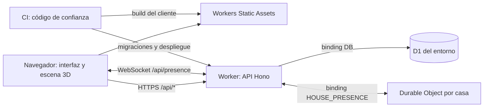

# Propuesta de infraestructura de Te Toca

Estado: configuración local implementada; infraestructura remota pendiente. Fecha de revisión: 2026-09-25.

## Base del análisis

Se revisaron el [README](../README.md), la [definición funcional](MVP_FUNCIONAL.md) y los recursos de marca en `public/brand/`, después de actualizar el repositorio hasta `d883c7e`. La aplicación, sus dependencias, migraciones y configuración local ya están implementadas. Este documento combina decisiones implementadas con el plan de publicación; no representa infraestructura remota provisionada.

El alcance actual es un juego de navegador para hogares de hasta seis personas, con tareas recurrentes, intercambios y recorrido guiado por una casa 3D. Los avatares muestran progreso guardado y presencia en tiempo real por habitación. Un Durable Object por casa coordina los WebSockets; D1 conserva tareas y apariencia.

El stack acordado en los documentos es React, TypeScript, Vite, React Three Fiber y Drei en el cliente; Hono y TypeScript en Workers; D1 para persistencia. Supabase no forma parte de esta propuesta.

## Arquitectura propuesta

| Componente | Responsabilidad | Decisión para el MVP |
| --- | --- | --- |
| Workers Static Assets | HTML, JavaScript, CSS, marca y catálogo 3D | Publicar junto al Worker |
| Worker con Hono | Sesiones, autorización, hogares, tareas e intercambios | Un Worker por entorno, organizado en módulos |
| D1 | Datos de negocio, apariencia y autenticación | Una base por entorno, binding `DB` |
| Durable Objects | Presencia, habitación e invalidación de datos por WebSocket | Clase `HousePresence`, binding `HOUSE_PRESENCE`, instancia por hogar |
| Dominio y HTTPS | Punto público de acceso | Subdominio inicial de Workers; dominio propio al lanzamiento si está disponible |
| R2 | Archivos grandes o contenido incorporado posteriormente | Opcional, fuera del despliegue inicial |

La web y la API compartirán origen. Configurar el fallback de SPA para navegación del cliente y hacer que `/api/*` pase primero por el Worker; una API inexistente debe responder JSON con 404, nunca el HTML de la aplicación. Assets con hash tendrán caché prolongada; HTML permitirá revalidación. Las respuestas con datos personales y sesiones usarán `Cache-Control: no-store`.

Cloudflare permite publicar el Worker y los archivos estáticos como una unidad. La selección de rutas evita ejecutar lógica de aplicación para cada archivo estático. [Static Assets](https://developers.cloudflare.com/workers/static-assets/), [rutas del Worker](https://developers.cloudflare.com/workers/static-assets/routing/worker-script/).

El navegador renderiza la casa, los avatares y las animaciones. Cargar la escena de forma diferida y mantener las vistas 2D y listas operativas sin WebGL. Solo el estado de negocio confirmado modifica el progreso visible; la cámara es local y los cambios de habitación se comparten por socket. Cada cliente anima el recorrido de los avatares conectados.

## Datos y consistencia

D1 guardará usuarios, sesiones, hashes de claves personales, hogares, integrantes, invitaciones, tareas, versiones de sus reglas de rotación, ocurrencias, intercambios e historial. Usar migraciones SQL versionadas, claves foráneas e índices por hogar, estado y fecha. La API derivará el hogar desde la sesión y verificará la pertenencia de cada recurso; D1 no aporta automáticamente el aislamiento por hogar que necesita el producto.

Reglas de implementación:

- Clave única `(task_id, due_date)` para las ocurrencias. Guardar fechas de calendario del hogar separadas de los instantes UTC de acciones y vencimiento de sesiones.
- Generar ocurrencias al consultar el hogar y después de cambios relevantes, recuperando fechas omitidas y los próximos siete días. Mantener una versión de calendario, participantes ordenados e índice de secuencia; no calcular la rotación a partir de tareas completadas.
- Acotar la recuperación por lotes y persistir el avance para períodos largos sin uso. Continuar mediante solicitudes posteriores sin duplicar ni presentar la recuperación parcial como completa. Un cron puede optimizar esto más adelante, pero la corrección no dependerá de él.
- Registrar cambios de frecuencia, participantes, pausa y reactivación con su fecha efectiva; conservar ocurrencias ya materializadas y no rellenar períodos pausados.
- Completar, deshacer y aceptar intercambios requieren condiciones SQL sobre estado, responsable y versión. La ventana de diez segundos para deshacer se comprobará con tiempo de servidor.
- Aceptar un intercambio debe validar y actualizar ambas ocurrencias, la solicitud y el historial en la misma operación atómica. También debe excluir una finalización concurrente o una segunda aceptación.
- Representar las reservas de intercambios pendientes con unicidad por ocurrencia; liberarlas al resolver o invalidar la solicitud. Validar el cupo de integrantes y el consumo de invitaciones de forma atómica.

D1 dispone de `batch()` transaccional: si una sentencia falla, se revierte el lote. Sin embargo, un `UPDATE` que afecta cero filas no es un error SQL. No alcanza con leer, validar en JavaScript y enviar escrituras incondicionales. La implementación deberá usar sentencias condicionadas con un guard común y restricciones o triggers que hagan fallar el lote si no se cumplen las precondiciones. El diseño SQL exacto se validará con pruebas de concurrencia antes de implementar las pantallas de intercambio. [API de D1](https://developers.cloudflare.com/d1/worker-api/d1-database/).

La generación concurrente y las acciones repetidas deben producir un único efecto. No habilitar réplicas de lectura inicialmente; si se incorporan, revisar explícitamente consistencia y lectura posterior a escritura.

## Autenticación con usuario y contraseña

El Worker registra usuarios sin correo electrónico, con username único normalizado y contraseña bcrypt de costo 12 con salt aleatorio. D1 almacena el hash en `user_credentials`. `bcryptjs` requiere `nodejs_compat`, configurado en Wrangler. Presupuestar el consumo de CPU del hashing al elegir el plan remoto: el costo 12 puede exceder el límite de CPU del plan gratuito.

Las sesiones siguen durando treinta días con cookies `HttpOnly`, `SameSite=Lax` y `Secure` sobre HTTPS. Los intentos tienen límites por IP y username. No se registran contraseñas, cookies ni códigos en logs.

Las cuentas anteriores pasan por configuración de credenciales utilizando su sesión o clave anterior. La transición mantiene todos sus datos y revoca las claves anteriores. Las invitaciones por código continúan iguales. No hay recuperación por correo implementada.

## Entornos y configuración

| Entorno | Recursos | Datos |
| --- | --- | --- |
| Local | Vite y emulación de Worker/D1 | Datos sintéticos |
| Staging | Worker y D1 propios | Usuarios y hogares de prueba |
| Producción | Worker y D1 propios, URL pública | Datos reales |

Versionar la estructura de `wrangler.jsonc`, migraciones, scripts y nombres de bindings. Mantener los identificadores de cuenta y recursos específicos fuera del repo público: generar la configuración concreta a partir de variables del entorno de despliegue. No usar la base de producción para previews.

Los bindings y variables deben declararse para cada entorno; no asumir herencia. Los secretos se cargan por entorno. El acceso del Worker a D1 se realiza mediante binding y no requiere insertar un token administrativo en el código. [Entornos](https://developers.cloudflare.com/workers/wrangler/environments/), [bindings](https://developers.cloudflare.com/workers/runtime-apis/bindings/).

`.env.example` contiene únicamente nombres de variables. `.env.local` se reserva para credenciales locales de herramientas y queda ignorado; no se presupone que los scripts lo carguen automáticamente. Usar `.dev.vars` ignorado para secretos locales del Worker y el almacén de secretos de Workers para ejecución remota. El token de despliegue reside en el almacén de secretos de CI y no se entrega al Worker ni al navegador. No usar prefijos `VITE_` para secretos.

## Publicación y actualizaciones

Propuesta: GitHub Actions como único mecanismo de CI/CD, evitando dos sistemas que desplieguen simultáneamente.

1. Incorporar build reproducible con lockfile, comprobación de tipos y pruebas de las reglas de negocio.
2. En pull requests, ejecutar validación sin credenciales de producción. No ejecutar código de forks con secretos ni utilizar `pull_request_target` para compilar código no confiable.
3. Desde código de confianza integrado en `main`, construir el artefacto y desplegar staging con su configuración y secretos.
4. Aplicar migraciones compatibles hacia adelante antes del Worker nuevo. Probar primero en staging; serializar despliegues y detener la publicación si una migración falla.
5. Ejecutar las pruebas de humo con dos usuarios: acceso, invitación, aislamiento entre hogares, rotación, completar, deshacer e intercambio simultáneo.
6. Promover el mismo commit y artefacto probado a producción mediante un job de release; aplicar sus migraciones y publicar Worker y assets.
7. Comprobar carga de la web, navegación directa, acceso por clave personal y API. Registrar versión publicada y procedimiento de rollback.

La primera publicación puede usar la URL asignada por Workers. Para dominio propio, configurar la zona, el dominio del Worker, y verificar HTTPS antes de distribuir enlaces. No hay un dominio elegido en esta propuesta.

Separar permisos de CI por entorno cuando sea posible. Para despliegue y migraciones se necesitan permisos de Workers y D1; añadir rutas/DNS solo al gestionar dominio, y R2 solo si se incorpora. No utilizar permisos de facturación o administración general para un pipeline de publicación. [Autorización de Workers](https://developers.cloudflare.com/workers/authorization/).

## Operación y recuperación

- Logs estructurados con identificador de solicitud, operación, duración y resultado; excluir datos personales, cabeceras de autenticación y contenido de tareas.
- Seguir errores 5xx, latencia de API, recuperación de ocurrencias y consumo de Workers/D1. Separar rechazos esperados de negocio de fallos internos.
- Definir alertas y límites de gasto/consumo disponibles antes de abrir el servicio. El costo depende de peticiones, CPU, lecturas/escrituras SQL, almacenamiento; no se asume costo cero ni se fija una tarifa sin revisar el plan vigente.
- Verificar la retención de D1 Time Travel del plan elegido y ensayar una restauración en un entorno de prueba. Actualmente la documentación de límites indica siete días en Free y treinta en Paid. [Límites de D1](https://developers.cloudflare.com/d1/platform/limits/), [recuperación](https://developers.cloudflare.com/d1/reference/time-travel/).
- Antes de una migración relevante, identificar un punto recuperable y realizar un export privado si corresponde. Los exports nunca se guardan en Git ni en assets públicos.
- Ante fallo de código, volver a la versión previa del Worker, siempre compatible con el esquema actual. Revertir código no revierte datos: restaurar D1 requiere valorar pérdida de escrituras posteriores, detener cambios y coordinar la recuperación.

## Decisiones pendientes y condición de salida

Antes de producción deben resolverse estrategia de recuperación de cuentas, dominio, plan y presupuesto, retención operativa y responsables de recuperación. Verificar los permisos efectivos y la habilitación de los servicios al provisionar, sin publicar detalles de cuentas o tokens en esta documentación.

R2 queda diferido porque el MVP no permite subir archivos y el catálogo puede acompañar al build. Si el tamaño de los modelos supera los límites del hosting estático o requiere publicación independiente, incorporarlo con binding y una política explícita de acceso. No se requieren inicialmente KV, Queues ni un cron. Durable Objects sí se utiliza para presencia; su migración `v1-house-presence` está definida en `wrangler.jsonc`. Usa WebSockets con hibernación, latidos y alarmas para descartar conexiones abandonadas y revalidar las sesiones.

La propuesta estará implementada cuando staging y producción estén separados, una versión pueda desplegarse y recuperarse de forma reproducible, las pruebas de concurrencia e aislamiento pasen y el flujo completo funcione en móvil, con teclado y sin WebGL. La infraestructura por sí sola no completa el MVP: deben cumplirse los criterios funcionales del producto.
